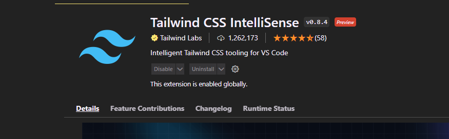

### Introduction to Tailwind CSS

[tailwind website](https://tailwindcss.com/)

### Add Tailwind CSS to Job Search Project

let's add tailwind to our project

```bash
🔥 ➜ vue add tailwind
```

### BONUS ES6 Array Spreading

```js
const fruits = ["apple", "banana", "orange"];
const vegetable = ["carrot", "tomato", "potato"];

// option 1
// const fruitsAndVegetables = fruits.concat(vegetable);

// option 2
const fruitsAndVegetables = [...fruits, ...vegetable];

console.log(fruitsAndVegetables);

// output
["apple", "banana", "orange", "carrot", "tomato", "potato"];
```

### Add Open Sans Font from Google Fonts

select a font you like and copy the link to the clipboard

add it to the index.html file

```html
<!DOCTYPE html>
<html lang="">
  <head>
    <meta charset="utf-8" />
    <meta http-equiv="X-UA-Compatible" content="IE=edge" />
    <meta name="viewport" content="width=device-width,initial-scale=1.0" />
    <link rel="icon" href="<%= BASE_URL %>favicon.ico" />
    <link rel="preconnect" href="https://fonts.googleapis.com" />
    <link rel="preconnect" href="https://fonts.gstatic.com" crossorigin />
    <link
      href="https://fonts.googleapis.com/css2?family=Open+Sans:wght@300;400;500;600;700;800&display=swap"
      rel="stylesheet"
    />
    <title><%= htmlWebpackPlugin.options.title %></title>
  </head>
  <body>
    <noscript>
      <strong
        >We're sorry but <%= htmlWebpackPlugin.options.title %> doesn't work
        properly without JavaScript enabled. Please enable it to
        continue.</strong
      >
    </noscript>
    <div id="app"></div>
    <!-- built files will be auto injected -->
  </body>
</html>
```

amd add the font to the tailwind config

```js
const defaultTheme = require("tailwindcss/defaultTheme");
module.exports = {
  content: ["./public/**/*.html", "./src/**/*.{vue,js,ts,jsx,tsx}"],
  theme: {
    extend: {
      fontFamily: {
        sans: ["Open Sans", ...defaultTheme.fontFamily.sans],
      },
    },
  },
};
```

### Try out Tailwind Styles

```vue
<template>
  <h1 class="mt-12 text-6xl text-center">Hello vue</h1>
</template>

<script>
export default {
  name: "App",
};
</script>
```

### Install Tailwind CSS Intellisense Extension


