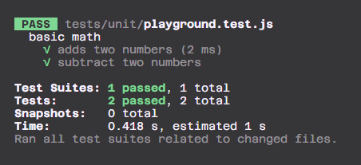
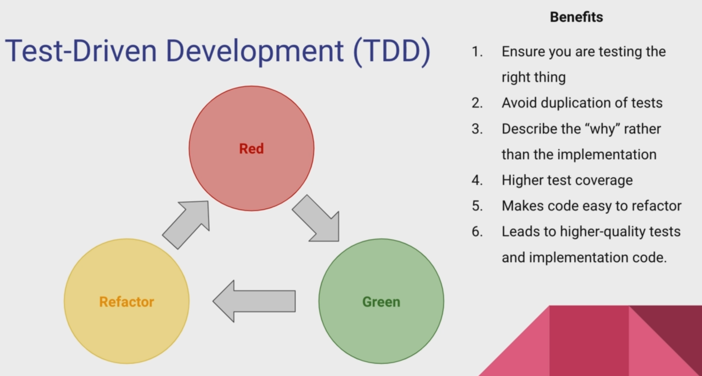
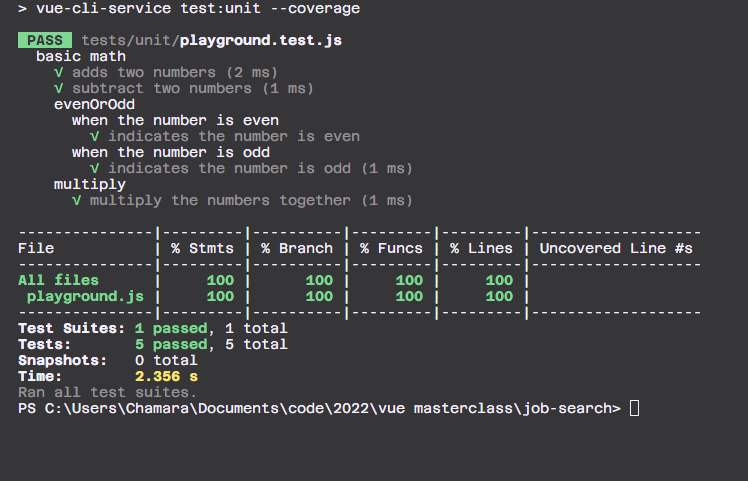

- [1. Why do we test](#1-why-do-we-test)
- [2. The Basics of Jest Syntax](#2-the-basics-of-jest-syntax)
- [3. Multiple Describe Blocks](#3-multiple-describe-blocks)
- [4. Intro to Test-Driven Development](#4-intro-to-test-driven-development)
- [5. Test Driven Development in Action](#5-test-driven-development-in-action)
- [6. Adding the —watch and —coverage Flags](#6-adding-the-watch-and-coverage-flags)
- [7. Quick Cleanup](#7-quick-cleanup)
- [8. Section Review](#8-section-review)

### 1. Why do we test

A unit test is a test that verifies that a particular piece of code works as expected.
A unit test should be as isolated as possible, and should not depend on any other code.
A unit test should be light weight and fast to run.
if there are dependencies on other code, we should mock or stub them out

### 2. The Basics of Jest Syntax

let's create a test file

```js
describe("basic math", () => {
  it("adds two numbers", () => {
    expect(1 + 1).toBe(2);
  });
  it("subtract two numbers", () => {
    expect(1 - 1).toBe(0);
  });
});
```

output



### 3. Multiple Describe Blocks

```js
import { evenOrOdd } from "@/playground";

describe("basic math", () => {
  it("adds two numbers", () => {
    expect(1 + 1).toBe(2);
  });
  it("subtract two numbers", () => {
    expect(1 - 1).toBe(0);
  });

  describe("evenOrOdd", () => {
    describe("when the number is even", () => {
      it("indicates the number is even", () => {
        expect(evenOrOdd(2)).toBe("Even");
      });
    });
    describe("when the number is odd", () => {
      it("indicates the number is odd", () => {
        expect(evenOrOdd(1)).toBe("Odd");
      });
    });
  });
});
```

### 4. Intro to Test-Driven Development



### 5. Test Driven Development in Action

we first write the test, then we write the code until the test passes

```js
describe("multiply", () => {
  it("multiply the numbers together", () => {
    expect(multiply(2, 2)).toBe(4);
  });
});
```

then the code

```js
export const multiply = (a, b) => a * b;
```

### 6. Adding the —watch and —coverage Flags

```json
 "scripts": {
    "serve": "vue-cli-service serve",
    "build": "vue-cli-service build",
    "test:unit": "vue-cli-service test:unit --coverage",
    "test:watch": "vue-cli-service test:unit --watch",
    "lint": "vue-cli-service lint"
  },
```

let's add those flags to our package.json


### 7. Quick Cleanup

remove the test file and clear the playground js file

### 8. Section Review
