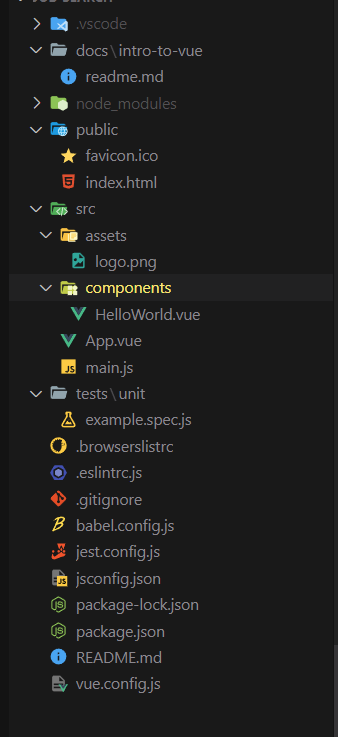

let's install vue cli

```bash
🔥 ➜ npm install -g @vue/cli
```

after install vue command will be available in your terminal

```bash
🔥 ➜ npm list -g
C:\Program Files\nodejs -> .\
├── @vue/cli@5.0.4
├── corepack@0.10.0
├── nodemon@2.0.16
├── npm@8.5.0
└── yarn@1.22.18
```

from the above command we can see that vue cli is installed

let's check the version of vue cli this command.

```bash
🔥 ➜ vue --version
@vue/cli 5.0.4
```

let run the vue command

```bash
🔥 ➜ vue
Usage: vue <command> [options]

Options:
  -V, --version                              output the version number
  -h, --help                                 display help for command

Commands:
  create [options] <app-name>                create a new project powered by vue-cli-service
  add [options] <plugin> [pluginOptions]     install a plugin and invoke its generator in an already created project
  invoke [options] <plugin> [pluginOptions]  invoke the generator of a plugin in an already created project
  inspect [options] [paths...]               inspect the webpack config in a project with vue-cli-service
  serve                                      alias of "npm run serve" in the current project
  build                                      alias of "npm run build" in the current project
  ui [options]                               start and open the vue-cli ui
  init [options] <template> <app-name>       generate a project from a remote template (legacy API, requires @vue/cli-init)
  config [options] [value]                   inspect and modify the config
  outdated [options]                         (experimental) check for outdated vue cli service / plugins
  upgrade [options] [plugin-name]            (experimental) upgrade vue cli service / plugins
  migrate [options] [plugin-name]            (experimental) run migrator for an already-installed cli plugin
  info                                       print debugging information about your environment
  help [command]                             display help for command

  Run vue <command> --help for detailed usage of given command.
```

[vue cli documentation](https://cli.vuejs.org/)

let's create a vue app

```bash
🔥 ➜ vue create job-search
```

answer the prompts and create a new project

1. create a new project
2. select manual mode
3. select unit testing
4. select prettier and eslint

### let's run the app

go the app directory

```bash
🔥 ➜ cd job-search
```

run the npm command

```bash
🔥 ➜ npm run serve
```

then you can see the app on the browser

### Hot reloading

app will auto reload after we save a file.

### vs code setup

let's install these extensions

1. prettier
2. eslint
3. vuter

### let's create a vs code configuration

```json
{
  "editor.formatOnSave": true,
  "editor.defaultFormatter": "esbenp.prettier-vscode",
  "editor.tabSize": 2,
  "eslint.validate": ["javascript", "vue"],
  "[javascript]": {
    "editor.defaultFormatter": "esbenp.prettier-vscode"
  }
}
```

### let's create a jest config file

```js
module.exports = {
  preset: "@vue/cli-plugin-unit-jest",
  testMatch: [
    "**/__tests__/**/*.{j,t}s?(x)",
    "**/?(*.)+(spec|test).[j,t]s?(x)",
  ],
};
```

### let's change the eslint config

```js
module.exports = {
  root: true,

  env: {
    node: true,
  },

  extends: [
    "plugin:vue/vue3-recommended",
    "eslint:recommended",
    "plugin:prettier/recommended",
  ],

  parserOptions: {
    parser: "@babel/eslint-parser",
  },

  rules: {
    "no-console": process.env.NODE_ENV === "production" ? "warn" : "off",
    "no-debugger": process.env.NODE_ENV === "production" ? "warn" : "off",
  },

  overrides: [
    {
      files: [
        "**/__tests__/**/*.{j,t}s?(x)",
        "**/?(*.)+(spec|test).[j,t]s?(x)",
      ],
      env: {
        jest: true,
      },
    },
  ],
};
```

### project structure



### how the view app is mounted

let's clear the `main.js` file.

let's import `createApp` from `vue`

```js
import { createApp } from "vue";
```

we need a root component for the createApp.

let's import the app component

```js
import App from "./App.vue";
```

now we have create a vue app let's mount this to our `index.html`.

```js
createApp(App).mount("#app");
```

let's see the final output code
`index.html`

```html
<!DOCTYPE html>
<html lang="">
  <head>
    <meta charset="utf-8" />
    <meta http-equiv="X-UA-Compatible" content="IE=edge" />
    <meta name="viewport" content="width=device-width,initial-scale=1.0" />
    <link rel="icon" href="<%= BASE_URL %>favicon.ico" />
    <title><%= htmlWebpackPlugin.options.title %></title>
  </head>
  <body>
    <noscript>
      <strong
        >We're sorry but <%= htmlWebpackPlugin.options.title %> doesn't work
        properly without JavaScript enabled. Please enable it to
        continue.</strong
      >
    </noscript>
    <div id="app"></div>
    <!-- built files will be auto injected -->
  </body>
</html>
```

`main.js`

```js
import { createApp } from "vue";
import App from "./App.vue";

createApp(App).mount("#app");
```

### @ symbol at the top of the directory

let's use the @ symbol import the `App` component

```js
import { createApp } from "vue";
import App from "@/App.vue";

createApp(App).mount("#app");
```

### the parts of a vue file

each file consists of three parts

1. the template
2. the script
3. the style

### more on components

advantages of components

- reusable
- like a function

```vue
<template>
  
  <HelloWorld msg="I am learning Vue" />
  <HelloWorld msg="reusing the components" />
</template>
```

### install vue-dev tools

install vue dev tools extension
